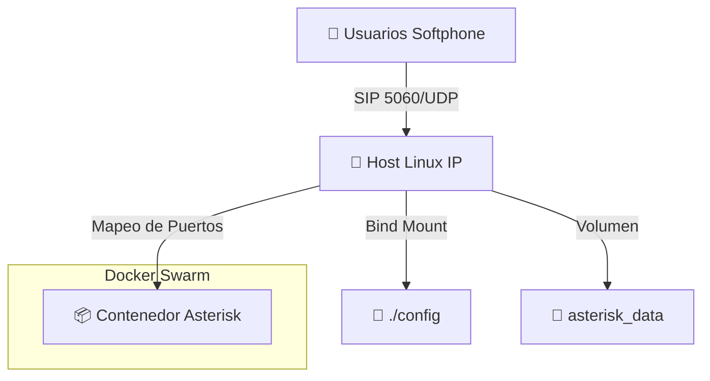

# 📞 PBX Virtual con Asterisk y Docker Swarm


> **Una solución VoIP ligera, escalable y contenerizada desplegada en Docker Swarm.**
> *Lista para comunicación interna, pruebas y fines educativos.*

---

## 🚀 Descripción del Proyecto

Este proyecto virtualiza una **Central Telefónica Privada (PBX)** utilizando **Asterisk** ejecutándose sobre **Alpine Linux**. Aprovecha **Docker Swarm** para la orquestación, asegurando alta disponibilidad y una gestión sencilla.

### 🎯 Características Clave
*   **🐳 Contenerizado:** Ejecuta en una imagen mínima `mlan/asterisk:mini`.
*   **🕸️ Listo para Swarm:** Configurado para Docker Swarm con manejo específico de puertos.
*   **🔒 Autenticación Segura:** Configuración PJSIP con credenciales robustas.
*   **🔊 Audio Claro:** Rangos de puertos RTP optimizados para evitar problemas de NAT.
*   **💾 Persistente:** Persistencia de datos y configuración mediante Bind Mounts y Volúmenes.

---

## 🛠️ Arquitectura



El sistema conecta usuarios de Softphones (Zoiper, MicroSIP) al Host Linux a través de SIP (puerto 5060) y RTP (puertos 10000-10999).

| Componente | Especificación |
| :--- | :--- |
| **Imagen Base** | `mlan/asterisk:mini` |
| **Señalización** | SIP sobre UDP (Puerto 5060) |
| **Medios (RTP)** | UDP Puertos 10000-10999 |
| **Driver** | PJSIP (Driver de Canal Moderno) |

---

## 📥 Instalación y Despliegue

### 1. Prerrequisitos
*   Servidor Linux (Ubuntu/Debian recomendado)
*   Docker Engine instalado
*   Docker Swarm inicializado (`docker swarm init`)

### 2. Clonar y Desplegar
```bash
# Clonar el repositorio
git clone <URL_DE_TU_REPO>
cd virtual

# Desplegar el stack
docker stack deploy -c docker-compose.yml pbx
```

### 3. Verificar Estado
```bash
docker service ls
docker service logs -f pbx_asterisk
```

---

## ⚙️ Configuración

### 📞 Extensiones
El sistema viene preconfigurado con dos extensiones internas:

| Extensión | Usuario | Contraseña | Contexto |
| :--- | :--- | :--- | :--- |
| **100** | `100` | `MiClaveSegura123` | `[internas]` |
| **101** | `101` | `MiClaveSegura123` | `[internas]` |

> **Nota:** Configura tu Softphone (Zoiper, MicroSIP) con **Transporte UDP**.

### 🔧 Archivos Clave
*   `docker-compose.yml`: Definición del Stack.
*   `config/pjsip.conf`: Configuración de endpoints SIP y transporte.
*   `config/extensions.conf`: Lógica del plan de marcado (Dialplan).

---

## 🧪 Pruebas

1.  **Conecta el Usuario 100** en tu PC.
2.  **Conecta el Usuario 101** en tu Celular.
3.  **Marca 101** desde tu PC.
4.  ¡Disfruta de un audio nítido! 🎧

---

## 🆘 Solución de Problemas (Troubleshooting)

| Problema | Solución |
| :--- | :--- |
| **Fallo de Registro (401)** | Verifica la contraseña (`MiClaveSegura123`) y el usuario. |
| **Sin Audio / Audio en un sentido** | Asegúrate de que `external_media_address` en `pjsip.conf` coincida con la IP de tu Host. |
| **Servicio Atascado** | Ejecuta `docker service update --force pbx_asterisk` para reiniciar. |

---

## 📜 Licencia
Este proyecto es de código abierto y está disponible bajo la Licencia MIT.

---
*Hecho con ❤️ por Tadeo y Copilot*

