# 📞 Virtual PBX with Asterisk & Docker Swarm


> **A lightweight, scalable, and containerized VoIP solution deployed on Docker Swarm.**
> *Ready for internal communication, testing, and learning purposes.*

---

## 🚀 Project Overview

This project virtualizes a **Private Branch Exchange (PBX)** using **Asterisk** running on **Alpine Linux**. It leverages **Docker Swarm** for orchestration, ensuring high availability and easy management.

### 🎯 Key Features
*   **🐳 Containerized:** Runs on a minimal `mlan/asterisk:mini` image.
*   **🕸️ Swarm Ready:** Configured for Docker Swarm with specific port handling.
*   **🔒 Secure Auth:** PJSIP configuration with strong credentials.
*   **🔊 Clear Audio:** Optimized RTP port ranges to avoid NAT issues.
*   **💾 Persistent:** Data and configuration persistence via Bind Mounts & Volumes.

---

## 🛠️ Architecture

```mermaid
graph TD
    User[📱 Softphone Users] -->|SIP 5060/UDP| Host[🐧 Linux Host IP]
    Host -->|Bind Mount| Config[📂 ./config]
    Host -->|Volume| Data[💾 asterisk_data]
    Host -->|Port Mapping| Container[📦 Asterisk Container]
    
    subgraph Docker Swarm
        Container
    end
```



| Component | Specification |
| :--- | :--- |
| **Base Image** | `mlan/asterisk:mini` |
| **Signaling** | SIP over UDP (Port 5060) |
| **Media (RTP)** | UDP Ports 10000-10999 |
| **Driver** | PJSIP (Modern Channel Driver) |

---

## 📥 Installation & Deployment

### 1. Prerequisites
*   Linux Server (Ubuntu/Debian recommended)
*   Docker Engine installed
*   Docker Swarm initialized (`docker swarm init`)

### 2. Clone & Deploy
```bash
# Clone the repository
git clone <YOUR_REPO_URL>
cd virtual

# Deploy the stack
docker stack deploy -c docker-compose.yml pbx
```

### 3. Verify Status
```bash
docker service ls
docker service logs -f pbx_asterisk
```

---

## ⚙️ Configuration

### 📞 Extensions
The system comes pre-configured with two internal extensions:

| Extension | Username | Password | Context |
| :--- | :--- | :--- | :--- |
| **100** | `100` | `MiClaveSegura123` | `[internas]` |
| **101** | `101` | `MiClaveSegura123` | `[internas]` |

> **Note:** Configure your Softphone (Zoiper, MicroSIP) with **UDP Transport**.

### 🔧 Key Files
*   `docker-compose.yml`: Stack definition.
*   `config/pjsip.conf`: SIP endpoints and transport settings.
*   `config/extensions.conf`: Dialplan logic.

---

## 🧪 Testing

1.  **Connect User 100** on your PC.
2.  **Connect User 101** on your Smartphone.
3.  **Dial 101** from your PC.
4.  Enjoy crystal clear audio! 🎧

---

## 🆘 Troubleshooting

| Issue | Solution |
| :--- | :--- |
| **Registration Failed (401)** | Check password (`MiClaveSegura123`) and username. |
| **No Audio / One-way Audio** | Ensure `external_media_address` in `pjsip.conf` matches your Host IP. |
| **Service Stuck** | Run `docker service update --force pbx_asterisk` to restart. |

---

## 📜 License
This project is open-source and available under the MIT License.

---
*Made with ❤️ by Tadeo & Copilot*

